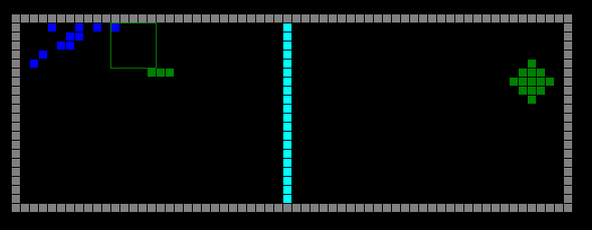

# Leader-Followers Team
[Research Report](paper/Report%20-%20Multi-agent%20Leader-Followers.pdf)

## Abstract
Local optima and sparse reward are two especially challenging problems for reinforcement learning (RL).

In single-agent RL, the standard approach to overcome these problems is to increase agent exploration. This is typically accomplished by increasing the temperature parameter of the softmax function or the epsilon parameter of the ε-greedy function during action selection.

In a multi-agent setting, these approaches may not be as effective. In our experiments, we discovered that increasing the temperature parameter of softmax can lead to worse results in our game. Also, even when a number of the agents chanced upon the global optimum, they have no way of communicating their findings to the other agents.

We propose a cross-functional team-based MARL framework (presented in the research report) for solving problems involving local optima and sparse reward. Under this framework, a cross-functional team consisting of a strategist, scouts, leaders and followers work together so that this team of agents can achieve the global optimum more effectively and efficiently.

Our current paper focuses on the leader-follower aspect of this framework. A team of agents are given a follower team culture during training. Under this culture, the follower agents are given imaginary rewards for assembling within a “target zone” (which represents the leader). The leader (target zone) is assumed to have a map of the game space and will guide its followers to the area of the game space where they can achieve the global optimum.

We demonstrate that the leader-followers team structure is a more reliable way of overcoming local optima and sparce reward, as shown in this [demo video](videos/leader-followers-team-demo.mp4). 

*click on picture to play video*

## Installation

`pip install -r requirements.txt`
